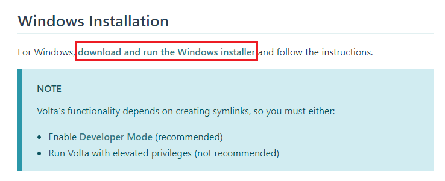
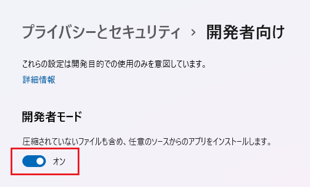

# Volta 導入と Node.js バージョン管理

## 目次

1. Volta インストール
1. Node.js インストール
1. Node.js バージョン切り替え
1. 全てのバージョンを確認
1. プロジェクトのバージョン管理

## Volta インストール

Volta は Node.js のバージョンを管理する CLI ツールです。
ホストマシンを Node.js 開発環境として使用するときプロジェクトに応じてバージョンを切り替えることができます。

[公式サイト](https://volta.sh/)

下記の URL から Windows 用インストーラをダウンロードしてください。

https://docs.volta.sh/guide/getting-started



ダウンロードしたファイルを実行して Volta をインストールします。
（2022/03/30 時点の最新版は`volta-1.0.6-windows-x86_64.msi`）

**注意点**

1. 既に Node.js をインストール済みの場合はアンインストールしてください。
1. Windows の「開発者向け」設定で「開発者モード」をオンにしてください。



## Node.js インストール

コマンドプロンプトを起動し以下のコマンドを実行します。

```sh
$ volta install node@16.14.0
```

node と npm がインストールされたら成功です。

```
success: installed and set node@16.14.0 (with npm@8.3.1) as default
```

試しに node と npm のバージョンを確認してみます。

```
$ node --version
v16.14.0
$ npm --version
8.3.1
```

## Node.js バージョン切り替え

複数のバージョンをインストールできます。

**サンプル**

```sh
$ volta install node@14
$ volta install node@12
```

最後に`volta install`したバージョンがデフォルトで使用されます。

```sh
$ node --version
v12.22.11
$ npm --version
6.14.16
```

デフォルトのバージョンを切り替えたい場合は再度`volta install`を実行してください。

```sh
$ volta install node@16.14.0
$ node --version
v16.14.0
$ npm --version
8.3.1
```

## 全てのバージョンを確認

```sh
$ volta list all
```

PC にインストールされている Node.js ランタイムがリスト表示されます。

```
⚡️ User toolchain:

    Node runtimes:
        v12.22.11
        v14.19.1
        v16.14.0 (default)

    Package managers:


    Packages:
```

## プロジェクトのバージョン管理

**pin コマンドでバージョン管理**

Node.js プロジェクトフォルダに移動し、以下のコマンドを実行します。

（Node.js プロジェクトの作り方：適当な空フォルダで`npm init`を実行すると`package.json`が出力されます）

```sh
$ volta pin node@16.14.0
$ volta pin npm@8.3.1
```

実行すると`package.json`の末尾にバージョン設定が追加されます。

```json
"volta": {
  "node": "16.14.0",
  "npm": "8.3.1"
}
```

`"volta"`設定があるプロジェクト内で node や npm を呼び出すと、必ず指定のバージョンが実行されます。

**設定ファイル編集でバージョン管理**

テキストエディタで`pacakge.json`を直接編集してバージョンを固定することもできます。

`pacakge.json`に未インストールのバージョンを記入しても node や npm を呼び出した時点で volta が自動的にインストールしてくれます。
