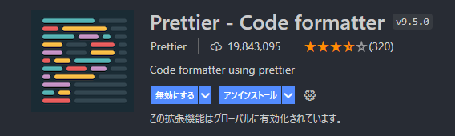
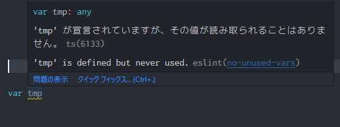

# React アプリの作り方

## 目次

1. 開発環境の準備
1. React プロジェクトの新規作成
1. ESLint 導入
1. Prettier 導入

## 開発環境の準備

### Node.js ランタイム

このプロジェクトでは Node.js バージョン管理に Volta を使用します。

（参考：[01_Volta導入とNode.jsバージョン管理](./01_Volta導入とNode.jsバージョン管理.md)）

`volta install`で Node.js をインストール（またはバージョン切替）します。

```sh
$ volta install node@16.14.0
```

### VSCode 拡張機能

テキストエディタは VSCode を使用します。
以下の拡張機能をインストールします。

#### ESLint

ESLint は JavaScript の静的検証ツールです。


#### Prettier - Code formatter

Prettier はソースコードの整形ツールです。



## React アプリの新規作成

React プロジェクトを作成するため create-react-app コマンドを使用します。

npx で create-react-app を実行します。コマンド引数にはプロジェクト名を渡します。

```sh
$ npx create-react-app my-app
```

> 《補足》
> `npx {コマンド名}`は npm でインストールしたコマンド名のパスを解決して実行します。
> コマンド名が見つからない場合は自動的にインストールします。

成功するとプロジェクトフォルダが新規作成されます。
（※現時点の最新版 React 18 を使用します）

> ※注意
> create-react-app は常に最新版の React を使ってプロジェクトを生成します。バージョンを固定したい場合はプロジェクトを Git リポジトリに保存しておき、新しくプロジェクトを新規作成するとき git clone すればテンプレートとして利用できます。

**アプリ起動**

プロジェクトフォルダに移動して`npm start`を実行します。

```sh
$ cd my-app
$ npm start
```

localhost のポート 3000 番で Web サーバが起動します。

Web ブラウザが起動して`http://localhost:3000/`を開きます。

このときソースコードを編集するとアプリは自動的にビルドされるのでリアルタイムに変更を確認できます。

**Node.js バージョン固定**

`package.json`の末尾に`"volta"`の設定を追加しておきます。

```json
"volta": {
  "node": "16.14.0"
}
```

**public/index.html の日本語設定**

`public/index.html`の`lang`属性が`en`になっているので`ja`に変更します。

```html
<html lang="ja">
```

**src/index.js の React 18 対応**

React 17 まで使用していた`ReactDOM.render`が非推奨になりました。
create-react-app が生成した`src/index.js`が古いテンプレートの場合、以下のように`src/index.js`を編集する必要があります。

```js
import React from 'react'
import * as ReactDOM from 'react-dom/client'
import './index.css'
import App from './App'
import reportWebVitals from './reportWebVitals'

const container = document.getElementById('root')
const root = ReactDOM.createRoot(container)

root.render(
  <React.StrictMode>
   <App />
  </React.StrictMode>
)

reportWebVitals()
```

## ESLint 導入

VSCode の ESLint 拡張機能をインストールしているとコーディング中に警告やエラーが表示されます。

**ESLint 警告の例**



> 《補足》
> create-react-app で作ったプロジェクトはデフォルトで eslint がインストールされています。npm で別途インストールする必要はありません。

## Prettier 導入

Prettier を使ってソースコードの自動整形を行います。

**フォーマット設定**

| 項目        | 値    | 意味                      |
| ----------- | ----- | ------------------------- |
| semi        | false | セミコロンなし            |
| singleQuote | true  | シングルクォートを使用    |
| tabWidth    | 2     | タブ幅に 2 スペースを使用 |
| endOfLine   | "lf"  | 改行コードに LF を使用    |

`.prettierrc`を新規作成します。

```json
{
  "semi": false,
  "singleQuote": true,
  "tabWidth": 2,
  "endOfLine": "lf"
}
```

ファイル保存時に Prettier を自動起動するように`.vscode/settings.json`を新規作成します。

```json
{
  "editor.defaultFormatter": "esbenp.prettier-vscode", // フォーマッタに Prettier を使用
  "editor.formatOnSave": true // 保存時にフォーマット実行
}
```
